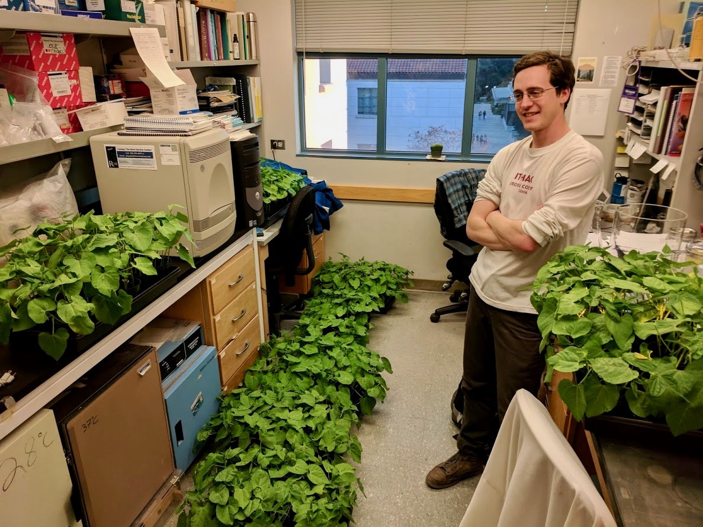

### Tyler C. Helmann

I'm currently a postdoctoral research molecular/computational biologist in the USDA-ARS [Emerging Pests and Pathogens Research Unit](https://www.ars.usda.gov/northeast-area/ithaca-ny/robert-w-holley-center-for-agriculture-health/emerging-pests-and-pathogens-research/), in Ithaca NY. My research background includes molecular plant-microbe interactions, plant pathology, microbiology, and bioinformatics. 

Originally from Ithaca, NY, I studied biology at Cornell before moving to Berkeley, CA for my PhD. It was at Cornell that I was first introduced to plant pathology, a field that combines many of my interests: biotechnology, plant biology, microbiology, epidemiology, and food. For this reason, being able to perform cutting edge research on campus is a true privilege, and I appreciate the opportunties to mentor and collaborate with driven and brilliant undergraduate and graduate students. I am working with multiple tools and techniques to explore the molecular mechanisms of virulence for bacterial plant pathogens. My goal is to apply exciting novel technologies to diverse biological systems including consequential pathogens of crop plants.

Feel free to contact me at tch54@cornell.edu or tyler.helmann@usda.gov.

### Links

[Google Scholar](https://scholar.google.com/citations?user=deR6NvwAAAAJ&hl=en&oi=ao)

[Twitter](https://twitter.com/tylerhelmann)

[LinkedIn](https://www.linkedin.com/in/tyler-helmann/)

[GitHub](https://github.com/tylerhelmann)
